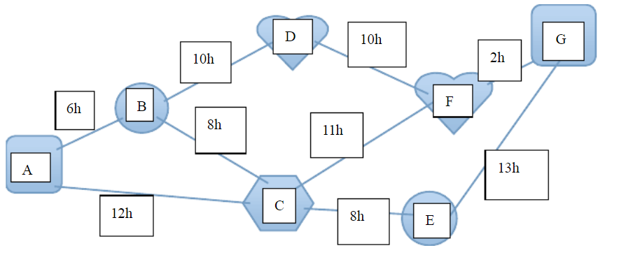

Dijkstra算法练习 --加单
1. 练习1

一只居住在A地的胖蜗牛比较懒，但是很聪明，有一个月他没写完作业，可是第二个月要交作业，
他要去借鉴他朋友们的作业（他的朋友分别居住在B,C,D,E,F,G地），
求他从A出发到各个朋友家花费的最短时间.

这一题比较简单，如果将示例明白，这题问题就不大了。

2.[练习题2](http://poj.org/problem?id=1502])
这题需要理清楚题意，然后才开始动手。
参考代码：[DijkstraDemo3]()