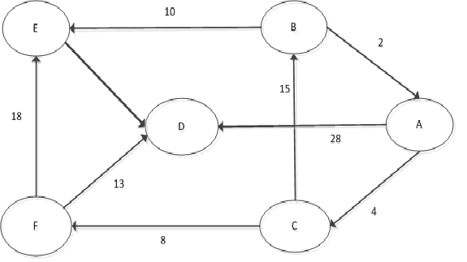

#一、引言
> 上次两个算法是否沉淀了呢? 这次我们换一种，我们来学会偷懒~
> 单源最短路径（Dijkstra算法），将偷懒进行到底~。
> 大家有兴趣，可以将三个算法对比分析一下。

#二、 小小问题
* Q：如图，小明(标号为A)到其他同学的最短距离是多少呢？（注意箭头方向）  



看着这个图是不是一脸蒙呢？ 注意箭头~~


结果应该是：
````    
|    始点     | 终点 |最短路径  | 路径长度|
| ---------- | --- | ------  | -------|
|     A      |  B  |  A,C,B  |   19   |
|            |  C  |  A.C    |   4    |
|            |  D  | A.C.F.D |   25   |
|            |  E  | A,C,B,E |   29   |
|            |  F  | A,C,F   |   12   |
````

* Q：两点之间如何存储边的距离呢？ 

比如B->A的长度为2 length[A][B]=2 这样是不是不错? 所以我们可以得到下面的表格了。∞ 代表不能到达
````
|    |  A  | B | C | D  | E | F | 
| ---|-----|-- |-- | -- | --| --|
|  A | 0   | ∞ | 4 | 28 | ∞ | ∞ | 
|  B | 2   | 0 | ∞ | ∞  | 10| ∞ |
|  C | ∞   |15 | 0 | ∞  | ∞ | 8 |
|  D | ∞   | ∞ | ∞ | 0  | ∞ | ∞ |
|  E | ∞   | ∞ | ∞ | 4  | 0 | ∞ |
|  F | ∞   | ∞ | ∞ | 13 | 18| 0 |
````

那么问题来了.** Q:如果用Java来解决，我们输入这些点，这些边的数据，能不能得出A点到其他点的最短距离呢？**
通过二维表格我们可以知道从A点初始时到各个点的距离（不一定是最短的距离）：
````
|    |  A  | B | C | D  | E | F | 
| ---|-----|-- |-- | -- | --| --|
|  A | 0   | ∞ | 4 | 28 | ∞ | ∞ | 
````
我们根据这个例子，将这个走一遍看看怎么做;
- 先找距离A最近的顶点， 通过上面的表格可以知道离A最近的是C点。当选择了C点。A到C的最短距离就确定了，至于为什么，你们能说出来吗？ 因为C点是距离A点最近的点，因为边的长度为正数，所以A能通过其他点到C，但是长度没C的短。
- 选择了C，C有两条出路:(C->B)和 (C->F) .这怎么算呢? 先判断(A->C)+(C->B)这条路能否比(A->B)的路程短 。然后比较发现(A->C)+(C->B) <(A->B) 因此更新 length[A][B] =19;  然后判断(A->C)+(C->F)这条路能否比(A->F)的路程短。然后发现(A->C)+(C->F)< (A->F) 因为更新length[A][F]=12
更新完后的长度为：
````
|    |  A  | B | C | D  | E | F  | 
| ---|-----|-- |-- | -- | --| -- |
|  A | 0   | 19| 4 | 28 | ∞ | 12 | 
````
----------
- 然后继续在除了C以外的点，找距离A点最近的点。通过上面的表格，我们可以知道接下来最近的顶点是F。当选择了F点，(A-F)的最短距离就确定了，至于为什么？能说出来吗？
- 选择了F，F有两条出路：(F->D)和(F->E),同样的，怎么算呢?先判断(A->F)+(F->D)这条路是否比(A->D)的路程短。然后比较发现((A->F)+(F->D))(长度25)< (A->D)（长度28）,因此更新length[A][D]=25;然后判断(A->F)+(F->E)是否比(A->E)路程短。然后发现(A->F)+(F->E)<(A->E). 因此更新length[A][E]=30;
更新完后的长度为：
````
|    |  A  | B | C | D  | E | F  | 
| ---|-----|-- |-- | -- | --| -- |
|  A | 0   | 19| 4 | 25 | 30| 12 | 
````
----------
- 然后继续在除了C,F以外的点，找距离A点最近的点。通过上面的表格，我们知道最近的顶点是B。当选择了B，(A->B)的最短距离就确定了，再问一遍，是为什么呢？
- 选择B，B有两条出路：(B->E)和(B->A),同样的，怎么算呢?先判断(A->B)+(B->E) 这条路是否比(A->E)的路程短。然后比较发现((A->B)+(B->E))(29) < A->E(30)，因此更新length[A][E]=29.之后判断(A->B)+(B->A)是否比(A->A)的路程短。然后发现(A->B)+(B->A)>(A->A); 因此更新length[A][A] =0(其实不需要更新)
更新完后的长度为：
````
|    |  A  | B | C | D  | E | F  | 
| ---|-----|-- |-- | -- | --| -- |
|  A | 0   | 19| 4 | 25 | 29| 12 |
````
--------------
- 然后继续在除了C,F,B以外的点，找距离A点最近的点。通过上面的表格，我们知道最近的点是D。当选择了D，A->D的最短句里就确定了。选择D，没有任何处理。继续找距离A点最近的点，接下来最近的点是E;E只有一条出路：E->D;先判断A->D+E->D这条路是否比A->D的路程短。然后比较发现((A->E)+(E->D))(长度33) > (A->D)(29)
更新完后的长度为：

```
|    |  A  | B | C | D  | E | F  | 
| ---|-----|-- |-- | -- | --| -- |
|  A | 0   | 19| 4 | 25 | 29| 12 | 
```
--------------

这个过程的代码如何写呢？
````
package dijkstra;
import java.util.Scanner;
/**
 * Created by Administrator on 2018/5/20.
 * target: Dijkstra算法示例
 * 输入：
 6 9
 0 1 1
 0 2 12
 1 2 9
 1 3 3
 2 4 5
 3 2 4
 3 4 13
 3 5 15
 4 5 4
 * 输出：
 * 0 1 8 4 13 17
 *
 * @author danqiusheng
 */
public class Dijkstra {
    static int INF = Integer.MAX_VALUE;//无法到达

    public static void main(String[] args) {
        Scanner read = new Scanner(System.in);
        // 输入points, edges 顶点数和边树
        int points = read.nextInt();
        int edges = read.nextInt();


        int[][] length = new int[points][points];

        // 初始化边（当前点到当前点为0）
        for (int i = 0; i < points; i++) {
            for (int j = 0; j < points; j++) {
                if (i == j) length[i][j] = 0;
                else length[i][j] = INF;
            }
        }

        read.nextLine();

        //输入顶点关系
        for (int i = 0; i < edges; i++) {
            String[] data = read.nextLine().split(" ");
            length[Integer.parseInt(data[0])][Integer.parseInt(data[1])] = Integer.parseInt(data[2]);
        }

        // 用一个一维数组存储当前点到其他点的距离，因为要根据二维表获取点到点的距离,不更改二维表的数据
        int[] distance = new int[points];

        // 初始化1点点到其余各个顶点的初始路程
        for (int i = 0; i < points; i++) {
            distance[i] = length[0][i];
        }

        // 定义一个flag数组。这个数组标记距离1最近的点被选择的数据
        boolean[] flag = new boolean[points];
        flag[0] = true;// 1点是最近的点，默认选择

        int min;
        int current = 0;
        for (int i = 0; i < points; i++) {
            min = INF;
            // 找寻距离1最短的点
            for (int j = 0; j < points; j++) {
                if (!flag[j] && distance[j] < min) {
                    min = distance[j];
                    current = j;
                }
            }
            // 设置这个距离1最短的点被选择
            flag[current] = true;

            // 获取这个最短的点到其他点的距离
            for (int m = 0; m < points; m++) {
                if (length[current][m] < INF) { // 判断是否为不可达
                    if (distance[m] > distance[current] + length[current][m]) {// 判断是否小于最短路径
                        distance[m] = distance[current] + length[current][m];
                    }
                }
            }
        }

        //输出最终的结果
        for (int i = 0; i < points; i++) {
            System.out.print(distance[i]+" ");
        }
    }
}

````

#三、概念
 >单源最短路径问题，即在图中求出给定顶点到其它任一顶点的最短路径。 Dijkstra提出按各顶点与源点v间的路径长度的递增次序，生成到各顶点的最短路径的算法。既先求出长度最短的一条最短路径，再参照它求出长度次短的一条最短路径，依次类推，直到从源点v 到其它各顶点的最短路径全部求出为止。


#四、总结
> 这个算法，看起来很简单，但是需要理解。参考书《啊哈，算法》，这本书讲算法不错。
> 上面的示例代码并不是最优的算法，相信大家看出来里面的时间复杂度是O(N*N)，在哪里可以优化，这里我先留个坑，日后来填~


#五、小试牛刀
> 题目要求的比较多，我就不贴出来，在git上。

- [Question](https://github.com/danqiusheng/algorithm_practice/blob/master/src/dijkstra/Question1.md)


#六、示例代码
- [DijkstraDemo1](https://github.com/danqiusheng/algorithm_practice/blob/master/src/dijkstra/DijkstraDemo1.java)